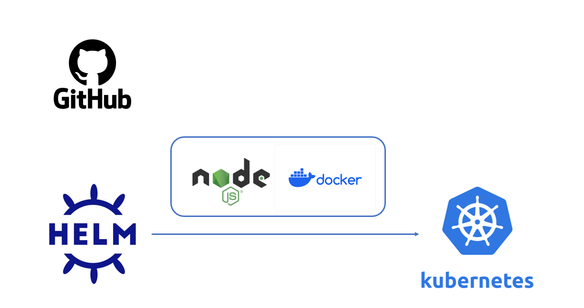

# Mock2023 - NamNT

The target of this mock is to deploy a NodeJS project with __Docker__, __Kubernetes__ and __Helm__.



# Deploy with Helm:

1. Validate if the values are getting substituted in the templates:
```bash
helm template .
```

2. Try `--dry-run` to see if there are issues first:
```bash
helm install --dry-run knote-dev knote-chart
```

3. Install the chart to get the release:
```bash
helm install knote-dev knote-chart
```

4. Uninstall the chart:
```bash
helm install knote-dev
```

5. Install with specified `dev-values.yaml` and `prod-values.yaml`:
```bash
helm install knote-dev knote-chart --values env/dev-values.yaml

helm install knote-prod knote-chart --values env/prod-values.yaml
```

6. Package the chart to share with others:
```bash
helm package knote-chart
```
